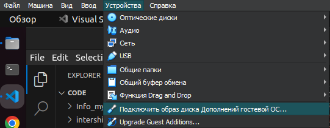

[Вернуться в раздел Стажировки](../intership.md)

# Содержанине раздела

0. [Установка гостевой ОС Ubuntu 22.04 в Windows](#0-начало-работы-с-ubuntu-2204)


# 0. Начало работы с Ubuntu 22.04

Прежде чем настраивать камеру, нужно верно настроить ОС Ubuntu, как гостевую ОС в основной ОС Windows.

1. После того как установили Ubuntu с помощью VirualBox, нужно запустить "Подключить образ диска Дополнений гостевой ОС"

<p align="center"></p>

2. Потом следует запустить папку, найти подключенный диск и открыть его. Далее из корня этого диска запустить терминал и запустить на выполение скрипт `VBoxLinuxAdditions.run`.

<p align="center"></p>

Этот скрипт позволить установить дополнительные программы и утилиты, которые позволят изменять расширение экрана, подключать USB устройства, сделать папку для обмена между гостевой и основной ОС.

3. После установки дополнительных утилит следует настроить папку для обмена между гостевой и основной ОС. Как это сделать можно почитать [тут](https://2domains.ru/support/vps-i-servery/kak-podklyuchit-obshchuyu-papku-v-virtualbox).

Но одним подключением не обойдётся, надо ещё добавить пользователя в группу, это даст доступ к папке для обмена файлами между системами.

```
sudo usermod -aG vboxsf $(whoami)
```

# 1. OpenIPC. Настройка камеры.

Для дальнейшей работы потребуется ознакомиться с [сайтом](https://openipc.org/?locale=ru).

**OpenIPC** — альтернативная открытая прошивка для IP-камер. 
OpenIPC — это открытая операционная система Linux для IP-камер с ARM и MIPS процессорами, призванная заменить собой закрытые, непрозрачные, небезопасные, часто заброшенные и неподдерживаемые прошивки, устанавливаемые при производстве оборудования. 
Простыми словами, этот проект позволяет перепрошить, настроить IP-камеры, что позволяет изменить IP адреса, пароли и другие настройки камер. Единственный минус - не все модели камер поддерживаются. Надо смотреть какие камеры можно перепрошить/настроить. Список поддерживаемых камер есть на [сайте](https://openipc.org/supported-hardware/featured).

Для настройки камеры понадобится установить TFTP-сервер. Инструкцию по установке можно прочитать [тут](https://github.com/OpenIPC/wiki/blob/master/en/installation.md)

```
sudo apt install tftpd-hpa
sudo sed -i '/^TFTP_OPTIONS/s/"$/ --create"/' /etc/default/tftpd-hpa
sudo systemctl restart tftpd-hpa.service
```

Посмотреть подключённые USB устройства

```
lsusb
```