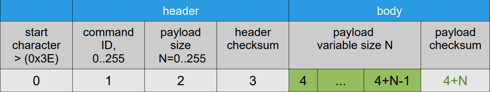
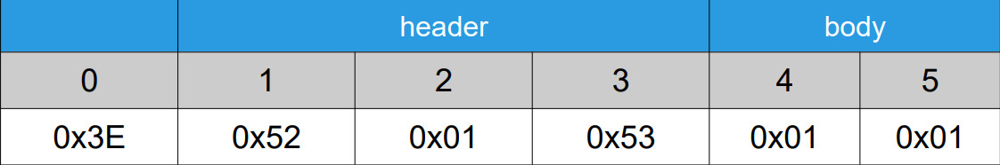
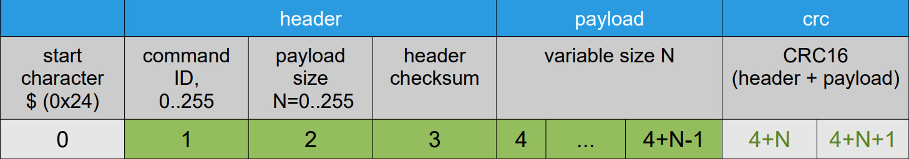
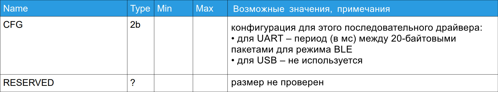
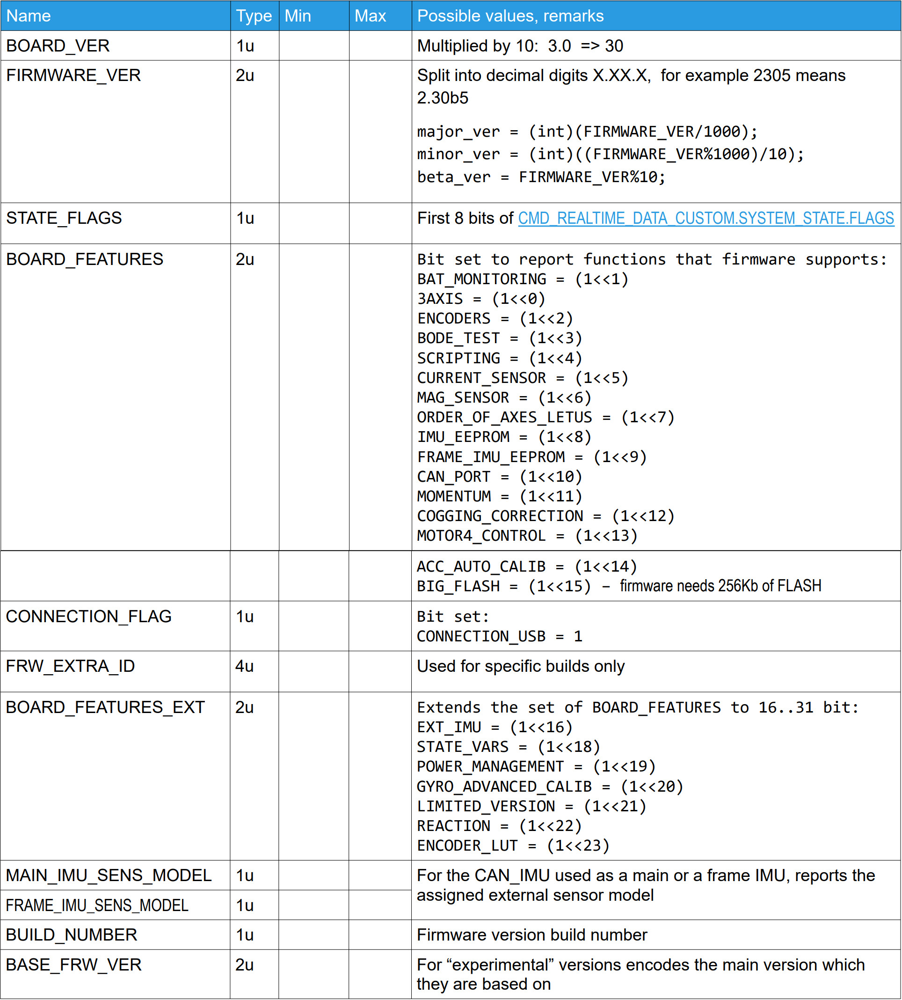
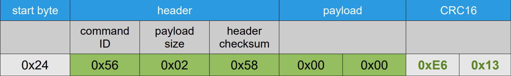

## Обзор

Serial API позволяет внешнему приложению или устройству взаимодействовать с контроллером SimpleBGC через последовательный порт (UART). Каждый контроллер имеет несколько портов UART, которые можно использовать для отправки или получения команд Serial API. Все модели оснащены портом USB, который виден как виртуальный Com-порт (VCP) для хост-машины. В зависимости от контроллера USB может быть выделенным или общим с одним из UART.

Команды могут использоваться для получения фактического состояния системы и данных в реальном времени, изменения настроек, управления подвесом, состояния триггерного контакта, выполнения различных действий, получения доступа к внутренней памяти EEPROM и шине I2C и т. д. Более того, программное обеспечение SimpleBGC GUI использует тот же протокол Serial API для связи с платой, поэтому все его функции могут быть реализованы в сторонних приложениях.

Связь инициируется с удаленной стороны (хоста) путем отправки исходящих команд. Контроллер может выполнять некоторые действия и отправлять ответ (для хоста это входящая команда).

Плата может работать на разных скоростях последовательной передачи данных, регулируемых параметрами, со значением по умолчанию 115200. Хост может автоматически найти правильную скорость передачи данных, отправив команду CMD_BOARD_INFO в цикле, изменяя скорость и ожидая ответа, пока не будет получен допустимый ответ, или должен разрешить указать скорость передачи данных в своих настройках.

Кроме того, плата может автоматически определять параметр «четности». Поддерживаются четность EVEN и NONE (NONE выбирается по умолчанию после запуска, а EVEN определяется автоматически). Это означает, что помимо скорости передачи данных хост-приложение должно изменять настройку четности при подключении через промежуточный уровень, который может иметь этот параметр неизвестным (например, модули Bluetooth). Для прямого подключения UART или USB VCP достаточно установить четность на «NONE».


## На протяжении всей емкости

Контроллер анализирует входящую очередь команд каждые 8 ​​мс, поэтому нет смысла отправлять команды одного типа с более высокой скоростью. Команды разного типа могут отправляться без задержки между ними. Хост-приложение отвечает за предотвращение переполнения входных и выходных буферов контроллера (по 255 байт каждый). Если новые последовательные данные приходят, когда входной буфер заполнен, всё сообщение будет потеряно. Если контроллеру приходится генерировать ответ, который не помещается в выходной буфер, он зависает до тех пор, пока в буфере не будет достаточно места для приема новых данных. Это может негативно повлиять на нормальную работу и даже сделать всю систему нестабильной. Единственным исключением является CMD_REALTIME_DATA_xx и несколько других, которые считаются необязательными для доставки.

Вы можете рассчитать безопасные скорости в соответствии с размером входящих и исходящих команд и настроенной скоростью передачи для последовательного порта. Учитывайте пропускную способность и стратегию буферизации промежуточного уровня передачи. Например, модули BLE имеют очень ограниченную пропускную способность и небольшие буферы. Кроме того, почти все радиомодемы имеют эффективную скорость передачи менее 100 Кбит/с в оптимальных условиях.


## Отладка

Вы можете настроить SimpleBGC32 GUI для отображения всех входящих и исходящих команд, которые он получает/отправляет.
Для этого запустите его в режиме «консоли» с помощью скрипта «run_console.bat». Команды будут отображаться на вкладке «Отладка» в формате:

`<local_time> <direction>: [<command_id>,<payload_length>] <payload_data_hex>`

Обратите внимание, что несколько команд с высокой скоростью не отображаются (например, CMD_REALTIME_DATA_xx).
Начиная с версии прошивки и GUI 2.66b4, можно отслеживать все сообщения последовательного API на всех других портах, подключив GUI к любому доступному последовательному порту, настроенному для режима SBGC Serial API, и включив для него опцию «Отладка» — «Установить как порт отладки». Контроллер будет пересылать все входящие и исходящие команды последовательного API со всех других портов на этот порт. Команды будут отображаться на вкладке «Отладка» в формате:

`<MCU_time> port<idx>.<direction>: [<command_id>,<payload_length>] <payload_data_hex>`

В этом случае направление «in» означает «на плату», «out» – «с платы».
Обратите внимание, что пересылаются только успешно проанализированные команды. Все неизвестные данные игнорируются.


## Формат сообщения

Каждая команда состоит из заголовка и тела, оба с контрольной суммой. Команды с неправильным заголовком или контрольной суммой тела, или с размером тела, отличающимся от ожидаемого, следует игнорировать. Парсер должен сканировать входящий поток данных на предмет следующего начального символа и пытаться из него восстановить синхронизацию .

Входные и выходные команды имеют одинаковый формат.

**Протокол версии 1**



Контрольная сумма заголовка рассчитывается как (ID команды + payload_size) по модулю 256.

Контрольная сумма полезной нагрузки рассчитывается как сумма всех байтов полезной нагрузки по модулю 256.

Операция «modulo» означает младший байт суммы.

Пример: исходящая команда для чтения Profile2:




Протокол версии 2

Начиная с версии прошивки 2.68b0, прошивка дополнительно поддерживает протокол версии 2, который имеет улучшенное отклонение ошибок за счёт замены старой 8-битной простой контрольной суммы (только по полезной нагрузке) на контрольную сумму CRC16 (по заголовку + полезной нагрузке).



По сравнению с версией 1, она имеет другой начальный символ "$" и другой расчёт контрольной суммы: контрольная сумма полезной нагрузки рассчитывается как CRC16 по байтам заголовка и байтам полезной нагрузки, начиная с индекса 1 до индекса 4+N-1. Эталонная реализация CRC16 с использованием полинома 0x8005 приведена в [Приложении A](#приложение-a-примеры-и-библиотеки).

**Блокировка протокола версии 2**

При запуске прошивка поддерживает сообщения в обеих версиях: 1 и 2. Но при получении первого допустимого сообщения версии 2 эта версия блокируется, и все входящие сообщения в версии 1 больше не распознаются.

Обозначение типа данных:
- 1u – 1 байт без знака
- 1s – 1 байт со знаком
- 2u – 2 байта без знака (порядок от младшего к старшему)
- 2s – 2 байта со знаком (порядок от младшего к старшему)
- 4f – float (стандарт IEEE-754)
- 4s – 4 байта со знаком (порядок от младшего к старшему)
- string – массив символов ASCII, первый байт – размер массива
- Nb – размер массива байтов N

Многие параметры сгруппированы в массивы, обозначенные квадратными скобками: «ANGLE[3]».
Параметры, которые разделены на оси, всегда идут в порядке ROLL, PITCH, YAW для углов Эйлера и соответствующих двигателей в нормальном положении. Для векторов порядок X, Y, Z в системе координат, где X направлен вправо, Y – вперед, Z – вверх.

ПРИМЕЧАНИЕ: порядок параметров в массивах всегда ROLL,PITCH,YAW, но он не соответствует порядку углов Эйлера, используемых для выражения вращения — он является переменным и определяется параметром «EULER_ORDER».

### Информация об устройстве

**Запросы**

> CMD_BOARD_INFO (#86) – запрос информации о плате и прошивке

Простой формат: без параметров

Расширенный формат:



> CMD_BOARD_INFO_3 (#20) – запрос дополнительной информации о плате

Нет параметров

**Ответы**

> CMD_BOARD_INFO (#86) – информация о версии и плате



> CMD_BOARD_INFO_3 (#20) – дополнительная информация о плате


## Приложение A: Примеры и библиотеки

Мы предоставляем комплексную библиотеку на языке C с примерами для различных платформ:

https://github.com/basecamelectronics/sbgc32-serial-api

Подробности см. в README.md.

### Реализация эталона CRC16 на языке C

```
void crc16_update(uint16_t length, uint8_t *data, uint8_t crc[2]) {
    uint16_t counter;
    uint16_t polynom = 0x8005;
    uint16_t crc_register = (uint16_t)crc[0] | ((uint16_t)crc[1] << 8);
    uint8_t shift_register;
    uint8_t data_bit, crc_bit;

    for (counter = 0; counter < length; counter++) {
        for (shift_register = 0x01; shift_register > 0x00; shift_register <<= 1) {
            data_bit = (data[counter] & shift_register) ? 1 : 0;
            crc_bit = crc_register >> 15;
            crc_register <<= 1;

            if (data_bit != crc_bit) crc_register ^= polynom;
        }
    }

    crc[0] = crc_register;
    crc[1] = (crc_register >> 8);
}

void crc16_calculate(uint16_t length, uint8_t *data, uint8_t crc[2]) {
    crc[0] = 0; crc[1] = 0;
    crc16_update(length, data, crc);
}
```

Пример с CRC16 для команды CMD_BOARD_INFO:


