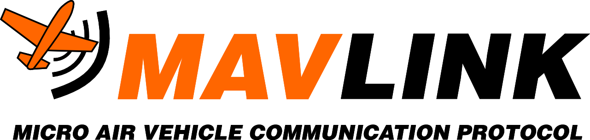

# Стажировка

## 1-ый день

2024-05-23 

До начала этого проекта я пробовал разобраться с протоколом передачи данных MAVLink. Я потратил примерно 2-3 часа.

Перед мной была посталвена задача сделать приложение которое выводит на экран окно с приборами (циферблаты со стрелками и др.). На этих приборах должна отображаться информация полученная от различных беспилотникых изделий. При этом было уточнено что между беспилотником и оператором/пунктом управления передача информации производится с помощью протокола **MAVLink** (Micro Air Vehicle Link).

С каким опытом и знаниями я подошёл к решению этой задачи в области программирования?!

Чтобы решить эту задачу я решил разбить её на следующие 2 подзадачи, которые разбил ещё на несколько более мелких задач:
1. Создать визуальную часть (frontend)
- Поискать примеры подобных приложений в сети.
- Подобрать инструменты которые больше подходят для выполнения данной задачи (язык программирования, библиотеки)
- Создать визуальную часть приложения
2. Создать часть отвечающую за логику работы (backend)
- Разобрать логику работы протокола MAVLink.
- Разобраться с тем как получать данные с беспилотника на пункт управления.
- Выбрать инструменты для написания логики, которые задействуют меньше системных ресурсов. 

#### План по изучению информации и созданию приложения 

Все пункты по номером 1 предполагаю делать параллельно.

Я составил следующий план работ, который выглядит следующим образом:
1. Сбор информации и выбор инструментов. Уточнение входных данных для задания.
- Создание плана работ чтобы понимать куда двигаюсь.
- Изучаю примеры в сети визуальной части приложения.
- Пробую понять возможности библиотек для создания визуальной части приложения.
- Разбираюсь с работой протокола MAVLink.
- Выбираю язык программирования исходя из своих знаний и собранной информации.
2. Создание приложения.
- Создание визуальной части в черновом варианте.
- Создание логической части.
- Доработка приложения подбор мелких шероховатостей.
- Отдать приложение другому человеку, который разбирается в беспилотнках, чтобы он мог проверить работу приложения.
- Доработать приложение с учётом отзывов от проверяющих.  

Тут я написал первую версию плана, которого я предполагаю придерживаться, чтобы было более понятно направление изучения информации и последовательность действий для создания приложения. Это не окончательный вариант. Дальше я буду дописывать этот план, но не изменять его, а переписывать его в тех днях, в которых решу вносить измениня.

## 2-й день

2024-05-25

### Протокол MAVLink

[Основной сайт про MAVLink](https://mavlink.io/en/)

Каждое сообщение в MavLink v2 состоит из заголовка и тела сообщения, обладая весом от 25 до 270 байт.

Сами сообщения подразделяются на два основных типа [15]:
1. Сообщения состояния — посылаются от БПЛА к НСУ и содержат информацию о позиции БПЛА, данные с датчиков и дополнительную информацию, необходимую НСУ.
2. Сообщения управления — посылаются от НСУ к БПЛА и содержат запросы на проведение некоторых действий.

Формат пакета MAVLink 1 аналогичен, но в нем отсутствуют `incompat_flags`, `compat_flags` и `signature`, а для адреса сообщения имеется только один байт. Для получения дополнительной информации см. Сериализация > Формат пакета .

## 3-й день

2024-05-25

