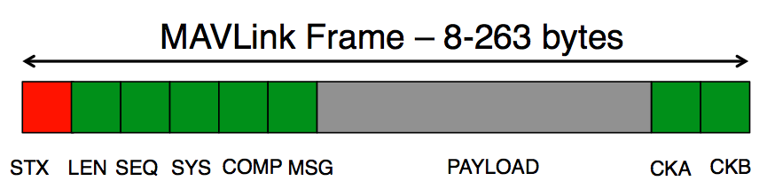

[Вернуться в файл Стажировки](intership.md)

[Основной сайт про MAVLink](https://mavlink.io/en/)

**MAVLink** или **Micro Air Vehicle Link** — это двоичный протокол телеметрии, разработанный для систем с ограниченными ресурсами и каналами с ограниченной полосой пропускания. Потоки телеметрических данных передаются в многоадресной схеме, в то время как части протокола, которые изменяют конфигурацию системы и требуют гарантированной доставки, такие как информация о миссиях или основных параметров, передаются по принципу «точка-точка» с повторной передачей.

Протокол описывает информационное взаимодействие между такими системами, как **MAV** (Micro Air Vehicle - беспилотники летающие, плавающие, ездеющие и т.д.) и **GCS** (Ground control station — станция наземного управления), а так же их составными частями — компонентами.

MAVLink развернут в двух основных версиях: v1.0 и v2.0, которые обратно совместимы (реализации v2.0 могут анализировать и отправлять пакеты v1.0).

Библиотека обрабатывает входные данные побайтово, добавляя их в буфер и сама собирает из них пакет. Каждая система или компонент, может одновременно обмениваться данными по разным источникам, тогда для каждого источника назначается специальный идентификатор, называемый channel (канал). MAVLink содержит буфер на каждый канал.

Библиотека MAVLink позволяет кодировать и раскодировать пакеты согласно протоколу, но она не регламентирует, какими аппаратными и программными средствами данные будет отправлены — это могут быть TCP/UDP сообщения, обмен через последовательный порт, да что угодно, что обеспечивает двухсторонний обмен.

Сами сообщения подразделяются на два основных типа:
1. Сообщения состояния — посылаются от БПЛА к НСУ и содержат информацию о позиции БПЛА, данные с датчиков и дополнительную информацию, необходимую НСУ.
2. Сообщения управления — посылаются от НСУ к БПЛА и содержат запросы на проведение некоторых действий.

Каждое сообщение в MavLink v2 состоит из заголовка и тела сообщения, обладая весом от 25 до 270 байт.

Базовой сущностью MAVLink является пакет, имеющий следующий формат:

1. Первый байт пакета (**STX**) — это символ начала сообщения:

MAVLink v2: HEX: 0xFD   =>   BIN: 0b11111101   =>   DEC: 253

MAVLink v1: HEX: 0xFE   =>   BIN: 0b11111110   =>   DEC: 254

MAVLink v0.9: HEX: 0x55   =>   BIN: 0b01010101   =>   DEC: 85

2. Второй байт пакета (**LEN**) — длинна полезной нагрузки (сообщения).

3. Третий байт пакета (**SEQ**) — содержит счётчик пакета (0-255), который помогает выявить потерю сообщения.

4. Четвёртый байт пакета (**SYS**) (System ID) — идентификатор (идентификационный номер) отправляющий системы.

5. Пятый байт пакета (**COMP**) (Component ID) — идентификатор отправляющего компонента.

6. Шестой байт пакета (**MSG**) (Message ID) — тип сообщения, от него зависит, какие данные будут лежать в полезной нагрузке пакета.

7. Последующие байты пакета (**PAYLOAD**) — полезная нагрузка пакета, сообщение, размером от 0 до 255 байт.

8. Два последних байта пакета (**CKA** и **CKB**) - нижний и верхний байт, соответственно, содержат контрольную сумму пакета.

Формат пакета MAVLink 1 аналогичен, но в нем отсутствуют `incompat_flags`, `compat_flags` и `signature`, а для адреса сообщения имеется только один байт. Для получения дополнительной информации см. Сериализация > Формат пакета .

[Вернуться в файл Стажировки](intership.md)